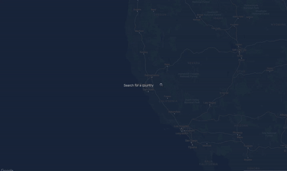
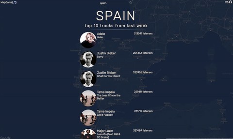
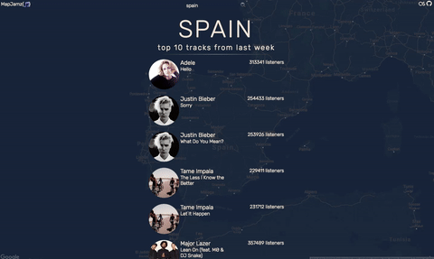

# [MapJamz](http://mapjamz.herokuapp.com/)

Don't know what to listen to? Find out what's popular in countries that you'd most like to travel to using MapJamz!

MapJamz is music discovery app to search weekly top tracks by country. The background dynamically changes as searches are made, and returned tracks can be streamed in-app.

## Usage

* Visit the MapJamz front page, and type in the country you would like to view the top 10 tracks for.

  

* To listen to a top track shown, click on the thumbnail of the artist and play using the YouTube widget.

  

* If you'd like to search for a different country's top tracks, then simply navigate to the search bar on the top of the page and type in your desired country.

  

## About MapJamz

This project was initially completed in my 6th week at Dev Bootcamp, and was built using Ruby, Sinatra, JavaScript (jQuery and AJAX). I used the Last.fm, Google Maps, and YouTube APIs.

Since then, MapJamz has grown to more accurately reflect track rankings of certain countries, such as South Korea. For this, the Melon API was integrated (thanks Zino!).

## Contributors

* [Young Ju (Sally) Park](http://github.com/parkyngj)
* [Zino Hu](http://github.com/zinosama)

If you are interested in improving or adding new awesome features to MapJamz, please feel free to submit a pull request for review at any time!
